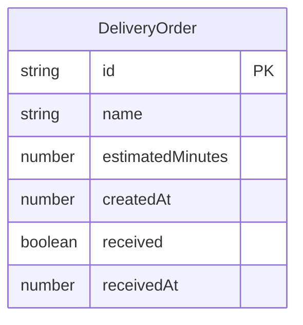

## 1. 架构设计

```mermaid
flowchart TB
    "前端 React 应用" --> "Zustand 状态管理"
    "Zustand 状态管理" --> "localStorage 持久化"
    "Zustand 状态管理" --> "setInterval 倒计时引擎"
    "setInterval 倒计时引擎" --> "React 组件渲染"
```

纯前端应用，无后端服务。所有数据存储在浏览器 localStorage，倒计时基于时间戳计算而非递减计数器，确保设备休眠后时间仍准确。

## 2. 技术说明

- **前端**：React@18 + Tailwind CSS@3 + Vite
- **初始化工具**：vite-init (react-ts 模板)
- **后端**：无
- **数据库**：localStorage（浏览器本地存储）
- **状态管理**：Zustand（含 localStorage 中间件）
- **图标**：lucide-react

## 3. 路由定义

| 路由 | 用途 |
|------|------|
| / | 主页面，包含所有外卖追踪横条和添加表单 |

## 4. 数据模型

### 4.1 数据模型定义



### 4.2 数据结构

```typescript
interface DeliveryOrder {
  id: string;
  name: string;
  estimatedMinutes: number;
  createdAt: number;
  received: boolean;
  receivedAt: number | null;
}
```

### 4.3 核心计算逻辑

- **剩余时间** = `createdAt + estimatedMinutes * 60 * 1000 - Date.now()`
- **颜色过渡**：根据剩余时间占比（remaining / total）插值计算
  - ratio > 0.5：蓝色→黄色插值
  - ratio ≤ 0.5：黄色→橙红色插值
- **持久化策略**：每次状态变更写入 localStorage，打开页面时从 localStorage 恢复并根据时间戳重新计算

### 4.4 Zustand Store 设计

```typescript
interface DeliveryStore {
  orders: DeliveryOrder[];
  addOrder: (name: string, estimatedMinutes: number) => void;
  receiveOrder: (id: string) => void;
  removeOrder: (id: string) => void;
  repeatLastOrder: () => void;
  getLastOrder: () => DeliveryOrder | null;
}
```
